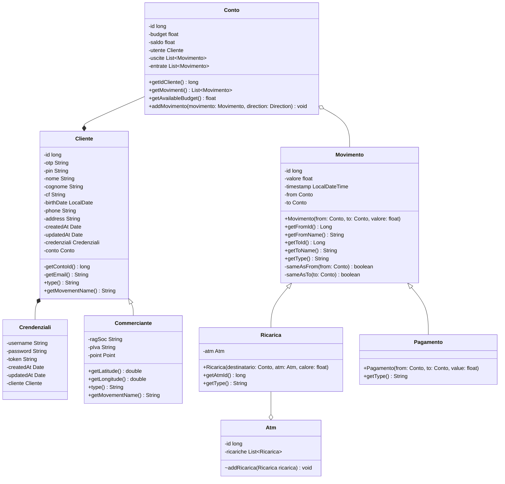

```mermaid
classDiagram
	Cliente *-- Crendenziali
	Cliente <|-- Commerciante
	Conto --* Cliente
	Conto o-- Movimento
	Movimento <|-- Ricarica
	Movimento <|-- Pagamento
	Ricarica --o Atm
	class Crendenziali {
		-username String
		-password String
		-token String
		-createdAt Date
		-updatedAt Date
		-cliente Cliente
	}
	class Commerciante {
		-ragSoc String
		-pIva String
		-point Point
		+getLatitude() double
		+getLongitude() double
		+type() String
		+getMovementName() String
	}
	class Cliente {
		-id long
		-otp String
		-pin String
		-nome String
		-cognome String
		-cf String
		-birthDate LocalDate
		-phone String
		-address String
		-createdAt Date
		-updatedAt Date
		-credenziali Credenziali
		-conto Conto
		-getContoId() long
		-getEmail() String
		+type() String
		+getMovementName() String
	}
	class Atm {
		-id long
		-ricariche List~Ricarica~
		~addRicarica(Ricarica ricarica) void
	}
	class Ricarica {
		-atm Atm
		+Ricarica(destinatario: Conto, atm: Atm, calore: float)
		+getAtmId() long
		+getType() String
	}
	class Pagamento {
		+Pagamento(from: Conto, to: Conto, value: float)
		+getType() String
	}
	class Movimento {
		-id long
		-valore float
		-timestamp LocalDateTime
		-from Conto
		-to Conto
		+Movimento(from: Conto, to: Conto, valore: float)
		+getFromId() Long
		+getFromName() String
		+getToId() Long
		+getToName() String
		+getType() String
		-sameAsFrom(from: Conto) boolean
		-sameAsTo(to: Conto) boolean
	}
	class Conto{
		-id long
		-budget float
		-saldo float
		-utente Cliente
		-uscite List~Movimento~
		-entrate List~Movimento~
		+getIdCliente() long
		+getMovimenti() List~Movimento~
		+getAvailableBudget() float
		+addMovimento(movimento: Movimento, direction: Direction) void
	}
	
	
```

