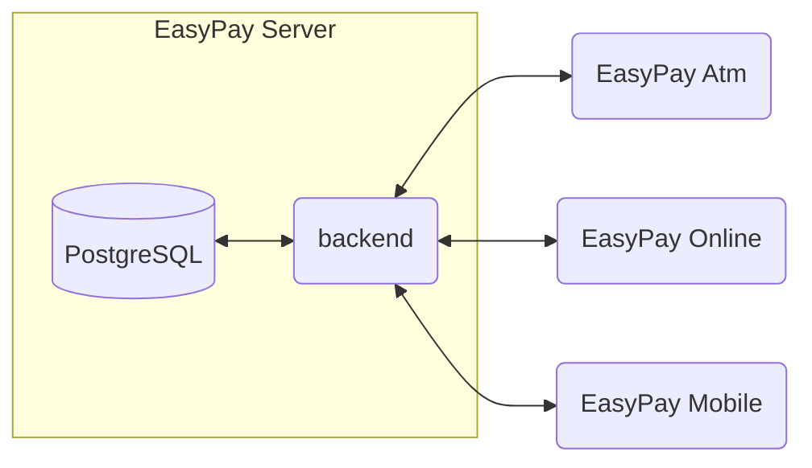

# EasyPay - Relazione tecnica

> NOTA: Github non supporta ancora gran parte delle funzioni più avanzate di md. per una corretta visualizzazione si consiglia di visualizzare la cartella doc con un visualizzatore di md più avanzato (es. [Typora](https://typora.io/) ) o di visualizzare la documentazione generata ed esportata in html TOTO: inserire l'url qui

 Il progetto è un lavoro universitario e non ha alcuna finalità commerciale. Il progetto è un semplice prototipo dell'idea

| Nome                       | EasyPay                                               |
| -------------------------- | ----------------------------------------------------- |
| **Project Manager**        | -                                                     |
| **Team di sviluppo**       | Mammolo Giuseppe, Micheletti Alessandro, Picco Simone |
| **Inizio lavori**          | -                                                     |
| **Prima Project Review**   | Gennaio 2019                                          |
| **Seconda Project Review** | Novembre 2019                                         |

| Revisioni documentazione |              |
| ------------------------ | ------------ |
| 02-2021                  | Picco Simone |

## Indice

[toc]

## Informazioni generali

EasyPay è il prototipo di un sistema di pagamento cliente-commerciante sia fisicamente tramite dispositivo `ATM`, sia  online tramite integrazione di api sulla piattaforma.

Lo scopo  del progetto è la realizzazione di un sistema di pagamenti innovativo che vada contro le normali problematiche dei competitors e i cui punti focali sono:

- fornire alternativa al contante per i piccoli e medi acquisti
- abbattere i costi fissi dei trasferimenti e dei pagamenti dei servizi online
- integrazione direttamente con i commercianti
- pagamento tramite smartphone e non

Fra gli obiettivi di EasyPay possiamo annoverare:

- l'essere un sistema per il pagamento online semplice e veloce
- il permettere trasferimento di denaro tra amici senza commissioni
- l'incentivazione della moneta elettronica
- l'utilizzabilità con qualsiasi banca convenzionata
- la fruizione dei servizi tramite cellulare e attività convenzionate

Mentre è possibile affermare che EasyPay non è:

- una banca.
- una carta virtuale associata ad una banca

## Specifiche Tecniche

Il progetto si suddivide in 4 macro-parti, ognuna con le sue caratteristiche proprie. Ad ognuna sarà dedicata una sezione specifica del presente documento. Le parti di cui si compone EasyPay sono:

- un backend: sviluppato utilizzando Spring Boot e PostgreSQL
- un frontend (EasyPay Atm): sviluppato utilizzando AngularJS
- una interfaccia integrabile in servizi terzi (EasyPay Online): sviluppata in AngularJS
- un applicativo android (EasyPay Mobile): sviluppato utilizzando Kotlin

Il backend è il fulcro attorno al quale ruotano gli altri moduli: questi si interfacciano e comunicano con il backend.

### Backend

Il backend è stato realizzato seguendo le linee guida per lo standard [REST](https://spring.io/guides/tutorials/rest/).

E' stata inoltre aggiunta una funzione di autenticazione secondo lo standard [JWT](https://jwt.io/introduction) per permettere l'invocazione dei servizi REST in maniera sicura.

La persistenza dei dati è stata implementata utilizzando [PostgreSQL](https://www.postgresql.org/) (scelta dettata dall'utilizzo di [Heroku](https://dashboard.heroku.com/) come piattaforma di rilascio). L'implementazione ha seguito le linee guida di standard per l'accesso ad dati tramite [Spring-data](https://spring.io/projects/spring-data).

Maggiori informazioni nel [README](https://github.com/Seniorsimo/EasyPay/)  principale del progetto.

### EasyPay Atm

Easypay-Atm è il frontend della vista dedicata al commerciante per la gestione delle operazioni e le interazioni fisiche con un cliente.

L'idea è la realizzazione di una interfaccia ispirata ad un ATM bancario. ma che permetta di effettuare semplici operazioni di pagamento e di ricarica da parte di un cliente che si presenta fisicamente al negozio.

Il punto di accesso predefinito è un dispositivo simile ad un tablet con videocamera per lettura di qrcode e sensore NFC. 

Maggiori informazioni nel [README](https://github.com/gmammolo/Easypay-atm)  del progetto.

### EasyPay Online

Easypay-Online è una sezione extra del progetto di EasyPay. Il suo scopo è la realizzazione di una interfaccia di pagamento online che un commerciante affiliato a Easypay può inserire sul suo sito per permettere al cliente di pagare.

Maggiori informazioni nel [README](https://github.com/gmammolo/EasyPay-online)  del progetto.

### EasyPay Mobile

Easypay-Mobile è la versione realizzata per smartphone Android dedicata ai clienti.
Tramite questa applicazione è possibile registrarsi alla piattaforma e, per coloro che sono registrati, è possibile visualizzare i movimenti effettuati sul proprio conto, effettuare pagamenti ed infine permette la visualizzazione su mappa dei commercianti convenzionati con la piattaforma.

Maggiori informazioni nel [README](https://github.com/MichelettiAlessandro/EasyPay_Mobile)  del progetto.

## Sviluppo

[Backlog](/doc/Backlog.md)

## Codice

- [Sequence diagram](/doc/Sequence%20Diagram.md)

- [ER Diagram](/doc/ER%20Diagram.md)

- [CRC Card](/doc/CRC%20Card.md)

- [Class diagram](/doc/Class%20Diagram.md)

- [Analisi Post Mortem del progetto](/doc/Analisi%20Post%20Mortem.md)

  
