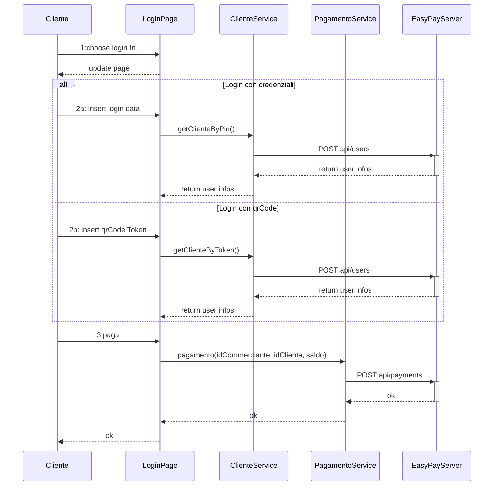

# Sequence Diagram

```mermaid
sequenceDiagram
	participant Cliente
	participant LoginPage
	participant ClienteService
	participant PagamentoService
	participant EasyPayServer
	
	Cliente->>LoginPage: 1:choose login fn
	LoginPage-->>Cliente: update page
	
	alt Login con credenziali
        Cliente->>LoginPage: 2a: insert login data
        LoginPage->>ClienteService: getClienteByPin()
        ClienteService->>+EasyPayServer: POST api/users
        EasyPayServer-->>-ClienteService: return user infos
        ClienteService-->>LoginPage: return user infos
	else Login con qrCode
        Cliente->>LoginPage: 2b: insert qrCode Token
        LoginPage->>ClienteService: getClienteByToken()
        ClienteService->>+EasyPayServer: POST api/users
        EasyPayServer-->>-ClienteService: return user infos
        ClienteService-->>LoginPage: return user infos
	end
	
	Cliente->>LoginPage: 3:paga
	LoginPage->>PagamentoService: pagamento(idCommerciante, idCliente, saldo)
	PagamentoService->>+EasyPayServer: POST api/payments
	EasyPayServer-->>-PagamentoService: ok
	PagamentoService-->>LoginPage: ok
	LoginPage-->>Cliente: ok
```

