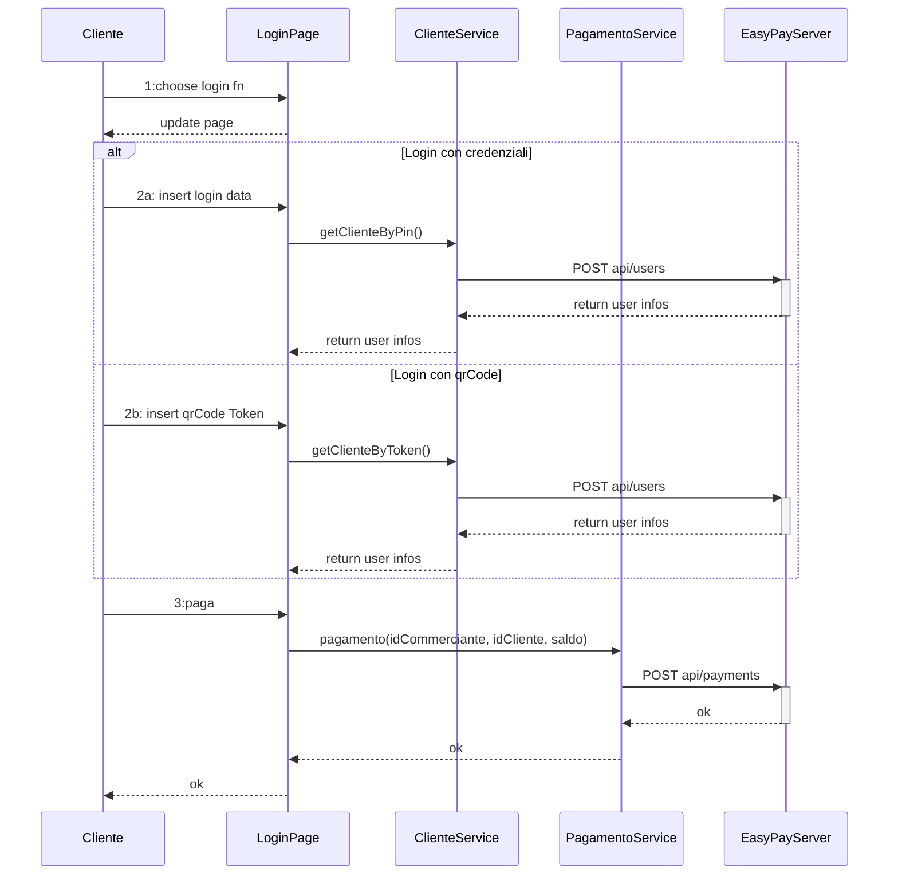
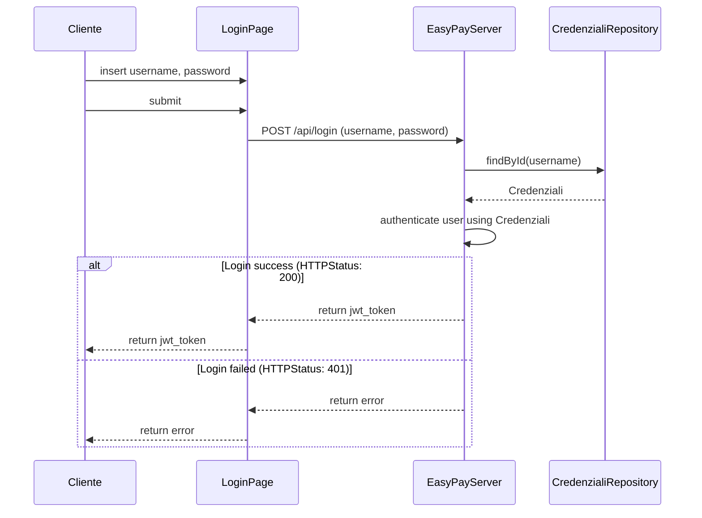
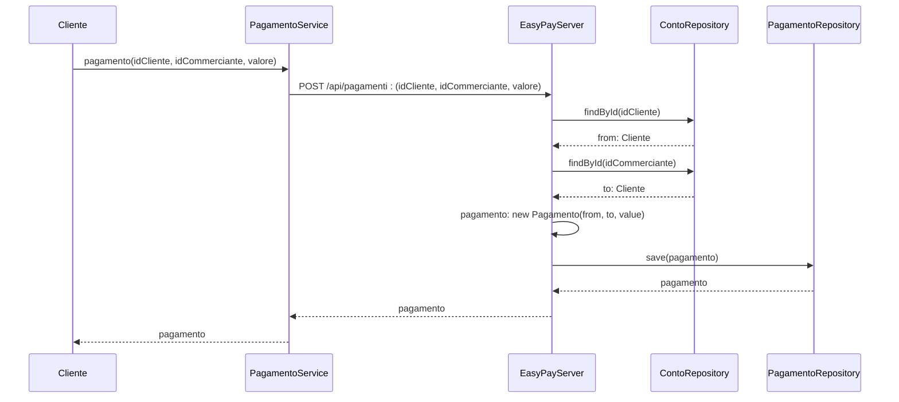
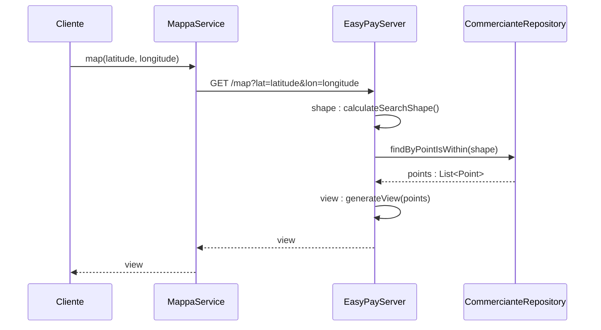

# Sequence Diagram

## Old

### Pagamento

```mermaid
sequenceDiagram
	participant Cliente
	participant LoginPage
	participant ClienteService
	participant PagamentoService
	participant EasyPayServer
	
	Cliente->>LoginPage: 1:choose login fn
	LoginPage-->>Cliente: update page
	
	alt Login con credenziali
        Cliente->>LoginPage: 2a: insert login data
        LoginPage->>ClienteService: getClienteByPin()
        ClienteService->>+EasyPayServer: POST api/users
        EasyPayServer-->>-ClienteService: return user infos
        ClienteService-->>LoginPage: return user infos
	else Login con qrCode
        Cliente->>LoginPage: 2b: insert qrCode Token
        LoginPage->>ClienteService: getClienteByToken()
        ClienteService->>+EasyPayServer: POST api/users
        EasyPayServer-->>-ClienteService: return user infos
        ClienteService-->>LoginPage: return user infos
	end
	
	Cliente->>LoginPage: 3:paga
	LoginPage->>PagamentoService: pagamento(idCommerciante, idCliente, saldo)
	PagamentoService->>+EasyPayServer: POST api/payments
	EasyPayServer-->>-PagamentoService: ok
	PagamentoService-->>LoginPage: ok
	LoginPage-->>Cliente: ok
```

## New

### Login

```mermaid
sequenceDiagram
	participant Cliente
	participant LoginPage
	participant EasyPayServer
	participant CredenzialiRepository
	
	Cliente->>LoginPage: insert username, password
	Cliente->>LoginPage: submit
	LoginPage->>EasyPayServer: POST /api/login (username, password)
	EasyPayServer->>CredenzialiRepository: findById(username)
	CredenzialiRepository-->>EasyPayServer: Credenziali
	EasyPayServer->>EasyPayServer: authenticate user using Credenziali
	alt Login success (HTTPStatus: 200)
		EasyPayServer-->>LoginPage: return jwt_token
		LoginPage-->>Cliente: return jwt_token
	else Login failed (HTTPStatus: 401)
		EasyPayServer-->>LoginPage: return error
		LoginPage-->>Cliente: return error
	end
```

### Pagamento online

```mermaid
sequenceDiagram
	participant Cliente
	participant PagamentoService
	participant EasyPayServer
	participant ContoRepository
	participant PagamentoRepository
	
	Cliente->>PagamentoService: pagamento(idCliente, idCommerciante, valore)
	PagamentoService->>EasyPayServer: POST /api/pagamenti : (idCliente, idCommerciante, valore)
	EasyPayServer->>ContoRepository: findById(idCliente)
	ContoRepository-->>EasyPayServer: from: Cliente
	EasyPayServer->>ContoRepository: findById(idCommerciante)
	ContoRepository-->>EasyPayServer: to: Cliente
	EasyPayServer->>EasyPayServer: pagamento: new Pagamento(from, to, value)
	EasyPayServer->>PagamentoRepository: save(pagamento)
	PagamentoRepository-->>EasyPayServer: pagamento
	EasyPayServer-->>PagamentoService: pagamento
	PagamentoService-->>Cliente: pagamento
```

### Richiesta mappa da mobile

```mermaid
sequenceDiagram
	participant Cliente
	participant MappaService
	participant EasyPayServer
	participant CommercianteRepository

	Cliente->>MappaService: map(latitude, longitude)
	MappaService->>EasyPayServer: GET /map?lat=latitude&lon=longitude
	EasyPayServer->>EasyPayServer: shape : calculateSearchShape()
	EasyPayServer->>CommercianteRepository: findByPointIsWithin(shape)
	CommercianteRepository-->>EasyPayServer: points : List<Point>
	EasyPayServer->>EasyPayServer: view : generateView(points)
	EasyPayServer-->>MappaService: view
	MappaService-->>Cliente: view
```

