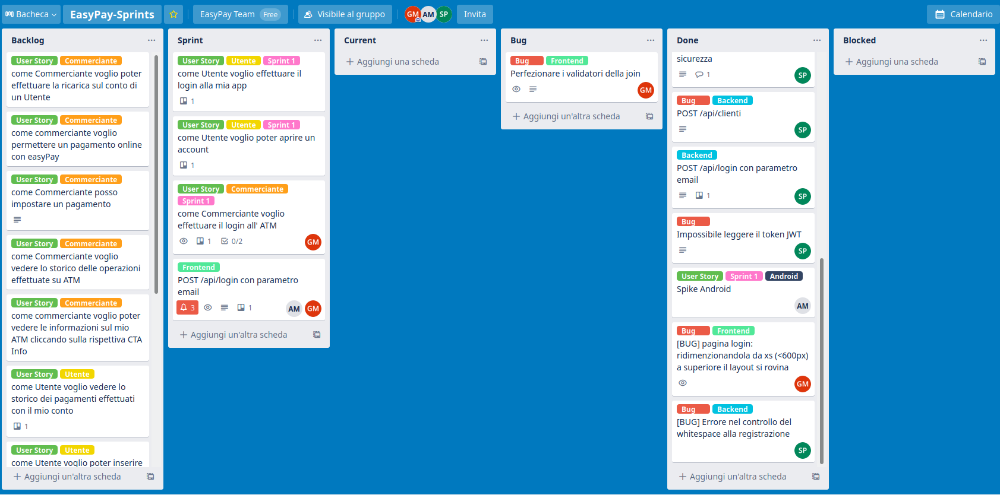
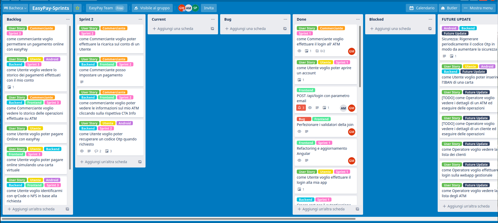
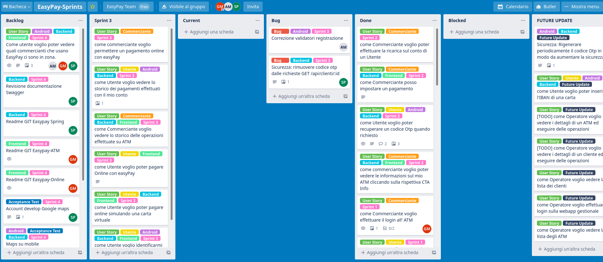
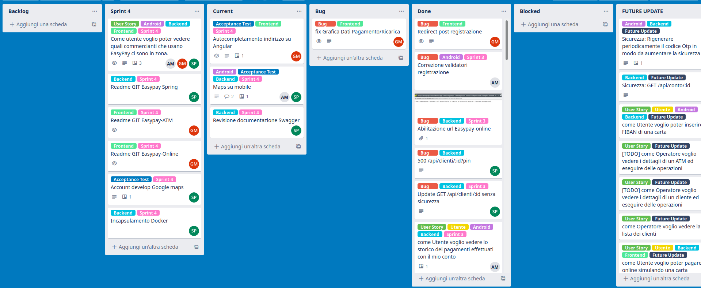

# Xtreme Programming

<qualche dettaglio sull'applicazione della metodologia agile nel nostro contesto>

## Variazioni effettuate

<mancanza dell'applicazione del pair programming ed un approccio alle user story più scrum oriented>

## Implementazione

### Sprint 1

Il primo sprint prevedeva l'implementazione delle funzionalità di base di login e creazione account.

In questo sprint si è partiti in anticipo con il backend (Spring) e il frontend (il progetto Easypay-ATM scritto in angular), in modo da poter iniziare lo sviluppo del mobile con delle funzionalità base del server già disponibili. In questa fase l'intero team si è concentrato principalmente sul backend, mettendo giù le basi per lo sviluppo successivo.

### Sprint 2

Nello sprint 2 lo sviluppo del Mobile è ufficialmente iniziato allineandosi allo sviluppo delle altre componenti.

Lato ATM si sono implementate le User Story che prevedevano le operazioni di pagamento.

### Sprint 3

Lato ATM e Mobile si sono implementati i movimenti effettuati dal cliente/commerciante.

Inoltre lato frontend si è aggiunto parallelamente lo sviluppo del progetto Easypay-Online.

### Sprint 4

Lo sprint finale. Ha previsto la chiusura degli ultimi problemi grafici riscontrati precedentemente nei vari progetti, l'integrazione con open Street Map (su Easypay-ATM si è integrato il servizio [nominatim](https://wiki.openstreetmap.org/wiki/Nominatim) per l'auto completamento dell'indirizzo, mentre su Backend l'integrazione con [leafletjs](https://leafletjs.com/)  per la mappa dei commercianti). 

Conclude questo sprint il perfezionamento della documentazione rilasciata insieme al progetto.

